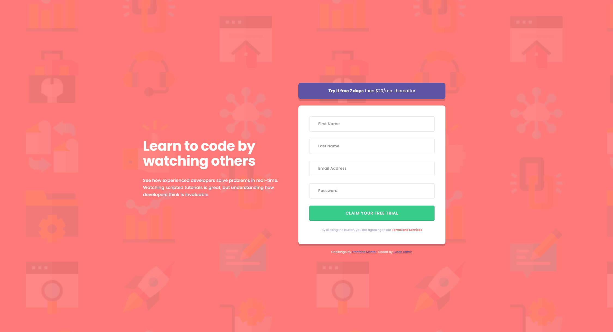

# Intro component with sign up form solution

This is a solution to the [Intro component with sign up form challenge on Frontend Mentor](https://www.frontendmentor.io/challenges/intro-component-with-signup-form-5cf91bd49edda32581d28fd1). Frontend Mentor challenges help you improve your coding skills by building realistic projects. 

## Table of contents

- [Overview](#overview)
  - [The challenge](#the-challenge)
  - [Screenshot](#screenshot)
  - [Links](#links)
- [My process](#my-process)
  - [Built with](#built-with)
- [Author](#author)
- [Acknowledgments](#acknowledgments)

## Overview

A simple and responsive sign up form with HTML, CSS and JavaScript. This is a part of the challenge of Frontend Mentor.

### The challenge

Users should be able to:

- See hover and focus states for all interactive elements on the page

### Screenshot

### Links

- Solution URL: [Github Repository](https://github.com/lucasdaher/blog-preview-card)
- Live Site URL: [Netlify Live Site](https://lucasdaher-blogpreviewcard.netlify.app/)

## My process

I started the project doing all the indexing.html and then moving on to the style.css styling. After all the HTML and CSS was done, I went to JavaScript, where I did a check for the email using **match** and the checks so that if the input value of each form is empty it changes the **span** that contains the error message and changes the styling of the input to the error style.

### Built with

- Flexbox

## Author

- GitHub - [My GitHub](https://github.com/lucasdaher)
- Frontend Mentor - [My Frontend Mentor Profile](https://www.frontendmentor.io/profile/lucasdaher)

## Acknowledgments

I get a lot of inspiration from a content creator called **ASMR Prog** ([YouTube ASMR Prog](https://www.youtube.com/@AsmrProg)). Some of his content, even if it is unexplained, ended up helping me at the beginning when I was learning and to this day it has been helping and influencing me a lot.